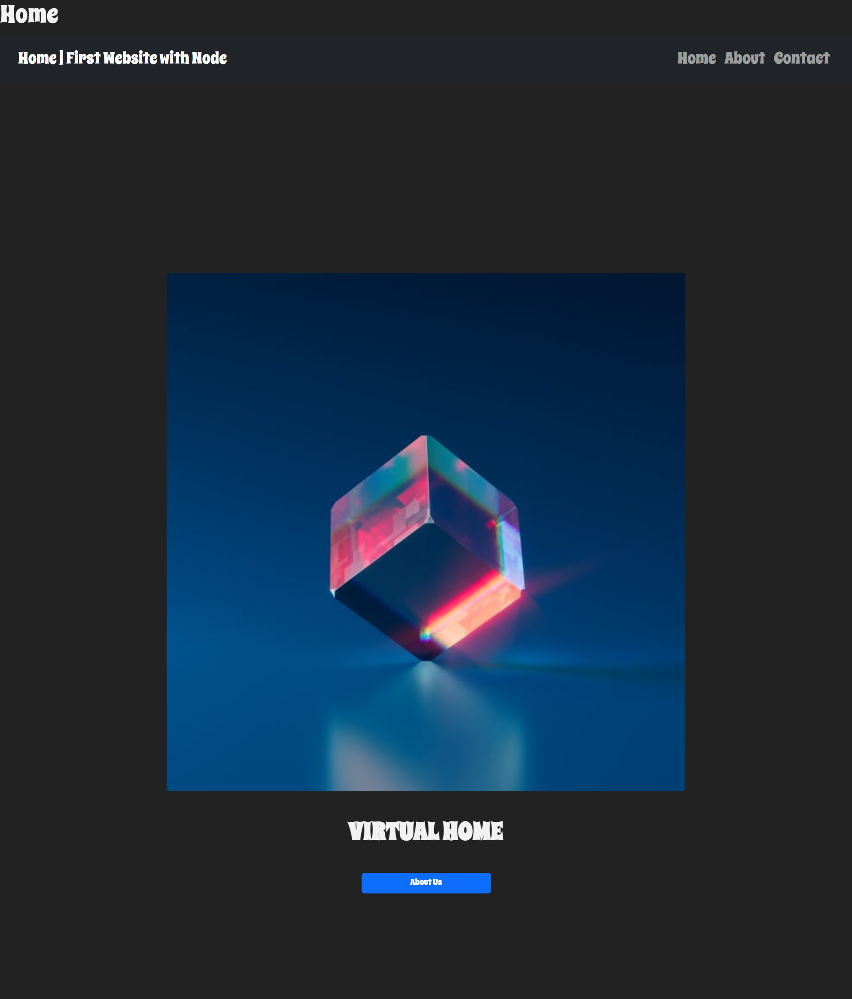
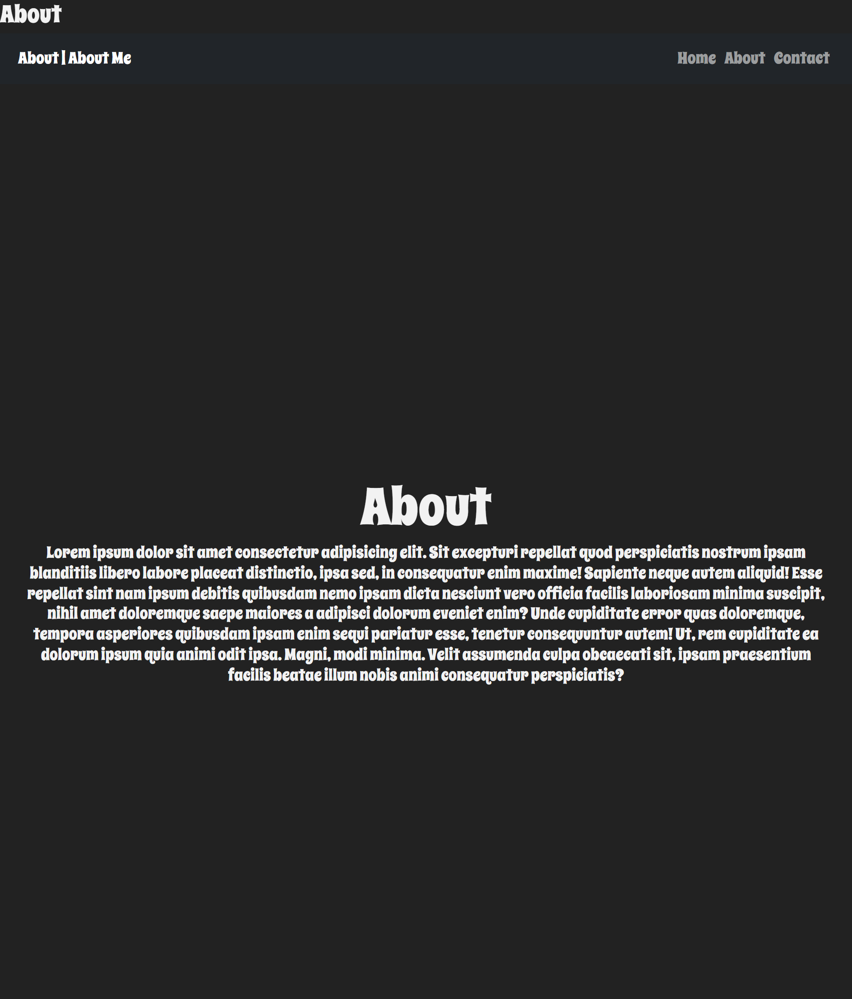
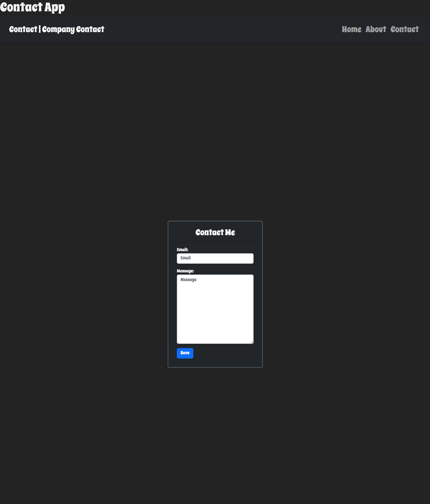
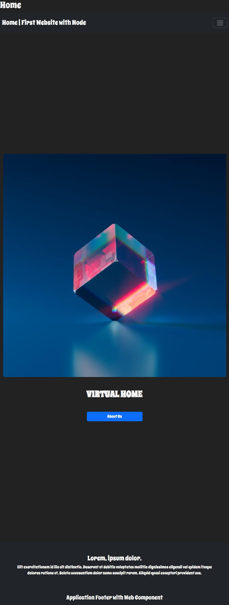
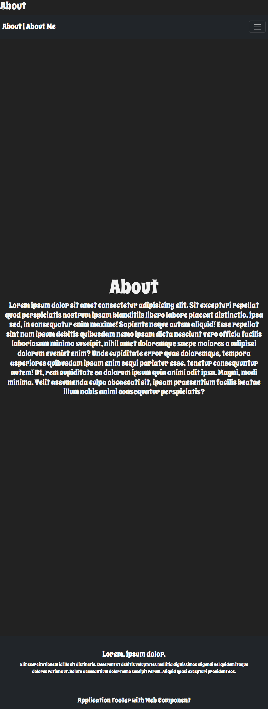
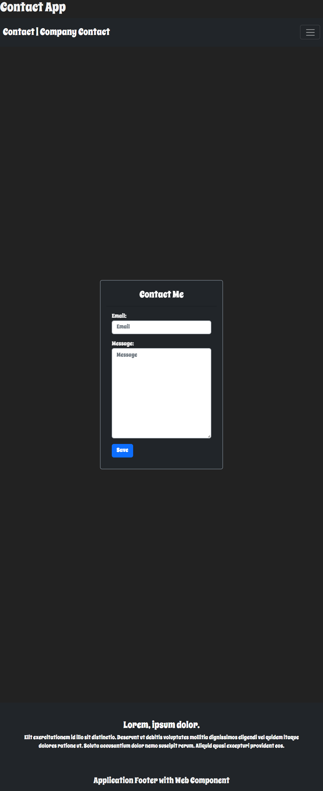

# application-nodeJs

Creating One Application with Node Js and Express. Add a Router and Bootstrap 5 for Backend and Front-end.  

# Reference Project: Fazt

> Fazt & Fazt Code

[Fazt](https://www.youtube.com/@FaztTech);

[Fazt_Code](https://www.youtube.com/@FaztCode);

# Tools Project Code && Design

## Express

> Express Js

[express](https://expressjs.com/es/)

```javascript

npm init

```

```javascript

npm install express --save

```

```javascript

npm install express

```

```javascript

entry point: (index.js)

```

```javascript
const express = require('express')
const app = express()
const port = 3000

app.get('/', (req, res) => {
  res.send('Hello World!')
})

app.listen(port, () => {
  console.log(`Example app listening on port ${port}`)
})
```

## Embedded JavaScript templates

> Embedded JavaScript templates (ejs)

[ejs_npm](https://www.npmjs.com/package/ejs)

```javascript

npm install ejs

```

> Example

```javascript

<% if (user) { %>
  <h2><%= user.name %></h2>
<% } %>

```

> Basic usage

```javascript
let template = ejs.compile(str, options);
template(data);
// => Rendered HTML string

ejs.render(str, data, options);
// => Rendered HTML string

ejs.renderFile(filename, data, options, function(err, str){
    // str => Rendered HTML string
});

```

## Nodemon (Node Js)

> Nodemon Install

[nodemon](https://nodemon.io/)

```javascript

npm install -g nodemon

npm install --save-dev nodemon

```

> Nodemon Documentation

[nodemon_gitHub](https://github.com/remy/nodemon#nodemon)

## Morgan NPM

> NPM Morgan

[morgan_npm](https://www.npmjs.com/package/morgan)

```javascript
npm i morgan
```

```javascript
var morgan = require('morgan')
```

```javascript

morgan(function (tokens, req, res) {
  return [
    tokens.method(req, res),
    tokens.url(req, res),
    tokens.status(req, res),
    tokens.res(req, res, 'content-length'), '-',
    tokens['response-time'](req, res), 'ms'
  ].join(' ')
})

```

## Bootstrap

[Bootstrap](https://getbootstrap.com/)

> Build fast, responsive sites with Bootstrap

```javascript

npm i bootstrap@5.3.0-alpha1

```

> CDN Bootstrap

```javascript
<link href="https://cdn.jsdelivr.net/npm/bootstrap@5.3.0-alpha1/dist/css/bootstrap.min.css">

<script src="https://cdn.jsdelivr.net/npm/bootstrap@5.3.0-alpha1/dist/js/bootstrap.bundle.min.js" </script>

```

## CDN (Content Delivery Network)

> CDN Js

[CDNjS](https://cdnjs.com/)

## Google FONTS

> Fonts

[Google_Fonts](https://fonts.google.com/)

## GitIgnore

> GitIgnore.io

[gitignore.io](https://www.toptal.com/developers/gitignore/)

### Project: Application With Node Js

> Index With Express

```javascript

//** === Express === (Type: module) */
//const express =  require(`express`);
//import ejs from `ejs`;
import express from 'express';
//** === Add Routing Absolute */
import { join, dirname } from 'path';
import { fileURLToPath } from 'url';

//** ===  Call Router === */
import router from './routes/index.js';

//**! App === */
const app = express();
//**! PORT === */
const port = process.env.port || 3000;

//**? === EJS / View Engine & Extend HTML & Rout View */
const __dirname = dirname(fileURLToPath(import.meta.url));
//const __dirname = path.dirname(new URL(import.meta.url).pathname);
//console.log(join(__dirname, `views`));

app.set(`views`, join(__dirname, `views`));
app.set(`view engine`, `ejs`);

//**! Routing === > Router */
/* app.get(`/`, (req, res) => {
  res.send(`Hello World!!`);
}); */
app.use(router);
//** === CSS */
app.use(express.static(join(__dirname, `public`)));

//**! Listen === */
app.listen(port, () => {
  console.log(`Server is running in Port: http://localhost:${port}`);
});

```

> Router

```javascript

import { Router } from 'express';
//** === app === router */
const router = Router();

router.get(`/`, (req, res) => {
  res.render(`index`, { title: `Home | First Website with Node` });
});
router.get(`/about`, (req, res) => {
  res.render(`about`, { title: `About | About Me` });
});
router.get(`/contact`, (req, res) => {
  res.render(`contact`, { title: `Contact | Company Contact` });
});

//** === Export === */
export default router;

```

> Home Application



> About Application



> Contact Application



> Mobile Project

> Home Mobile



> About Mobile



> Contact Mobile



### Deploy GitHub Pages

> GiHub Pages

[gitHub_pages](https://www.npmjs.com/package/gh-pages)

> Npm Instal

```javascript
npm i gh-pages

npm install gh-pages --save-dev

```

> Script

```javascript

"scripts": {
  "deploy": "gh-pages -d dist"
}

```

```javascript

npm run deploy

```

> Pages Application

[application_node](https://christiano0407.github.io/application-nodeJs/)
